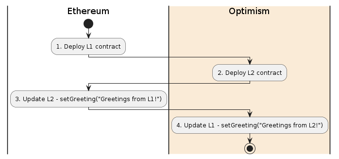

# Optimism Bridge Box

Truffle Optimism Bridge Box provides you with the boilerplate structure necessary to start building applications between multiple Ethereum network layers.

This box contains basic greeting contracts on L1 and L2, along with a set of migrations for deploying, calling functions, and passing state between them.

## 🚨🚨 Work In Progress 🚨🚨

---

- [Requirements](#requirements)
- [Installation](#installation)
- [Setup](#setup)
  - [Using the .env File](#using-the-env-file)
  - [New Configuration File](#new-configuration-file)
  - [New Directory Structure for Artifacts](#new-directory-structure-for-artifacts)
- [Optimistic Ethereum](#optimistic-ethereum)
  - [Compiling](#compiling)
  - [Migrating](#migrating)
  - [Basic Commands](#basic-commands)
  - [Testing](#testing)
  - [Communication Between Ethereum and Optimism Chains](#communication-between-ethereum-and-optimism-chains)
- [Support](#support)

<small><i><a href='http://ecotrust-canada.github.io/markdown-toc/'>Table of contents generated with markdown-toc</a></i></small>

## Requirements

The Optimism Box has the following requirements:

- [Node.js](https://nodejs.org/) 10.x or later
- [NPM](https://docs.npmjs.com/cli/) version 5.2 or later
- [docker](https://docs.docker.com/get-docker/), version 19.03.12 or later
- [docker-compose](https://docs.docker.com/compose/install/), version 1.27.3 or later
- Recommended Docker memory allocation of >=8 GB.
- Windows, Linux or MacOS

Helpful, but optional:

- An [Infura](https://infura.io/) account and Project ID
- A [MetaMask](https://metamask.io/) account

## Installation

> Note that this installation command will only work once the box is published (in the interim you can use `truffle unbox https://github.com/truffle-box/optimism-box`).

```bash
$ truffle unbox optimism-bridge
```

## Setup

### Installing dependencies

Install the necessary npm dependencies:

```bash
yarn install
```

### Using the env File

You will need at least one mnemonic to use with the network. The `.dotenv` npm package has been installed for you, and you will need to create a `.env` file for storing your mnemonic and any other needed private information.

The `.env` file is ignored by git in this project to help protect your private data. It is good security practice to avoid committing information about your private keys to github. The `truffle-config.ovm.js` file expects a `GANACHE_MNEMONIC` and a `KOVAN_MNEMONIC` value to exist in `.env` for running commands on each of these networks, as well as a default `MNEMONIC` for the optimistic network we will run locally.

If you are unfamiliar with using `.env` for managing your mnemonics and other keys, the basic steps for doing so are below:

1. Run `cp .env.example .env` in the command line to copy some important variables into a private `.env` file.
2. Open the `.env` file in your preferred IDE
3. Fill in your mnemonic for the networks you intend to use, as well as your [Infura key](https://blog.infura.io/getting-started-with-infura-28e41844cc89/).

_Note: the given value for the `MNEMONIC` variable is the one you should use, as it is expected within the local optimistic ethereum network we will run in this Truffle Box._

4. As you develop your project, you can put any other sensitive information in the `.env` file. You can access it from other files with `require('dotenv').config()` and refer to the variable you need with `process.env['<YOUR_VARIABLE>']`.

## Bridging

This box includes:

- An [L1 contract](/contracts/ethereum/GreeterL1.sol) that sends a message over the Optimism bridge.
- A [Migration](/migrations/3_set_L2_greeting.js) that sends a message from Ethereum to Optimism.
- An [L2 contract](/contracts/optimism/GreeterL2.sol) that sends a message over the Optimism bridge.
- A [Migration](/migrations/4_set_L1_greeting.js) that sends a message from Ethereum to Optimism.
- A [script](/scripts/deploy.mjs) to automate the process of compiling contracts and running migrations across each network.

Once you have installed dependencies and set up your `.env` file, you're ready to start bridging! Review and run the provided migrations to facilitate bridging messages between Optimism and Ethereum.

## Demo

Included is a helper [script](/scripts/deploy.mjs) that facilitates the full compilation, migration, and bridging of messages between Kovan and Optimism Kovan. To use it, you will need testnet ETH on those networks. Use [a faucet](https://community.optimism.io/docs/useful-tools/faucets/) if you need some. Once you have some on each, run:

```bash
yarn deploy
```

This script automates the following steps:



Upon completion of migration 3, you will be prompted with a link to confirm the bridged message via Etherscan:

```bash
🛣️  Bridging message to L2 Greeter contract...
🕐 In about 1 minute, check the Greeter contract "read" function: https://kovan-optimistic.etherscan.io/address/0xD4c204223d6F1Dfad0b7a0b05BB0bCaB6665e0c9#readContract
```

Upon completion of migration 3, you will be prompted with a link to confirm the bridged message via Etherscan:

```bash
🛣️  Bridging message to L2 Greeter contract...
🕐 In about 1 minute, check the Greeter contract "read" function: https://kovan-optimistic.etherscan.io/address/0xD4c204223d6F1Dfad0b7a0b05BB0bCaB6665e0c9#readContract
```

---

## Developing for Optimism

To learn more about developing for Optimism, see the [Truffle Optimism Box](https://github.com/truffle-box/optimism-box/)

## Support

Support for this box is available via the Truffle community available [here](https://www.trufflesuite.com/community).
